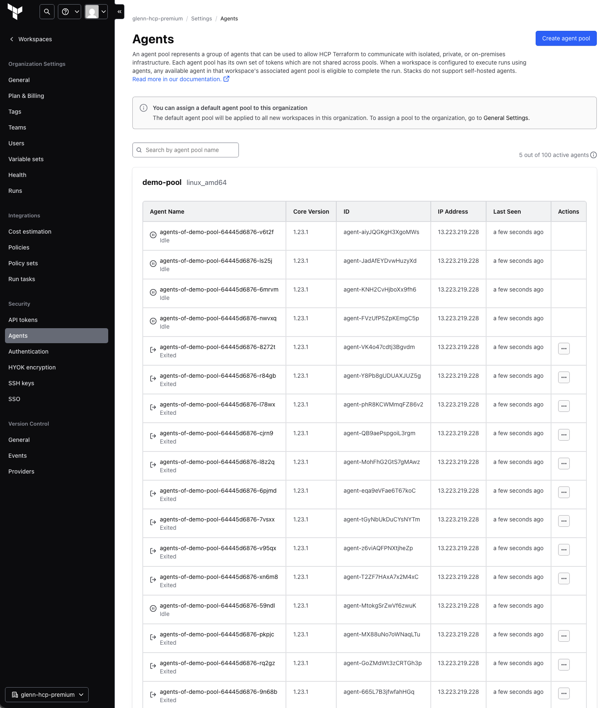

# HCP Terraform Operator for Agents on Amazon EKS Auto Mode

This repository demonstrates how to deploy and use the [HCP Terraform Operator](https://developer.hashicorp.com/terraform/cloud-docs/integrations/kubernetes) with a focus on [HCP Terraform Agents](https://developer.hashicorp.com/terraform/cloud-docs/agents) on [Amazon EKS Auto Mode](https://docs.aws.amazon.com/eks/latest/userguide/automode.html). The operator provides automatic scaling capabilities for agents, ensuring optimal resource utilization for your infrastructure automation workflows.

# 1. Architecture


# 2. Deployment

## 2.1 EKS Cluster

Step 1: Configure AWS credentials. For example:

```bash
export AWS_ACCESS_KEY_ID=example
export AWS_SECRET_ACCESS_KEY=example
export AWS_SESSION_TOKEN=example
```

Step 2: In the [tf/aws-eks](./tf/aws-eks/) directory, copy [tf/aws-eks/terraform.tfvars.example](./tf/aws-eks/terraform.tfvars.example) to `terraform.tfvars` and change the environment variables accordingly.

Step 3: In the [tf/aws-eks](./tf/aws-eks/) directory, run an apply, review the plan output, and approve the plan accordingly.

```bash
terraform init
terraform apply
```

## 2.2 HCP Terraform Team and Team Token

Step 1: Configure HCP Terraform credentials. Refer to the [tfe_provider authentication docs](https://registry.terraform.io/providers/hashicorp/tfe/latest/docs#authentication) for the various token options and guidance. For example:

```bash
export TFE_TOKEN=example
```

Step 2: In the [tf/hcp-team-token](./tf/hcp-team-token/) directory, run an apply, review the plan output, and approve the plan accordingly. The apply outputs the team token that has permissions to read workspaces and manage agent pools. This token is referenced by the Terraform Operator Agent Pool CRD.

> [!CAUTION]
> In a live environment it is not good practice to output the Terraform token. The token is output in this repo purely for demo purposes, such that readers can easily pass the token to the Terraform operator.

```bash
terraform init
terraform apply
```

## 2.3 Terraform Operator

Step 1: In the [tf/terraform-operator-base](./tf/terraform-operator-base/) directory, run an apply, review the plan output, and approve the plan accordingly.

```bash
terraform init
terraform apply
```

## 2.4 Terraform Operator Agent Pool

Step 1: In the [tf/terraform-operator-crd-agent](./tf/terraform-operator-crd-agent/) directory, copy [tf/terraform-operator-crd-agent/terraform.tfvars.example](./tf/terraform-operator-crd-agent/terraform.tfvars.example) to `terraform.tfvars` and change the environment variables accordingly.

Step 2: In the [tf/terraform-operator-crd-agent](./tf/terraform-operator-crd-agent/) directory, run an apply, review the plan output, and approve the plan accordingly.

> [!NOTE]
> [01-k8s.tf](./tf/terraform-operator-crd-agent/01-k8s.tf) configures the Terraform agent pool with `minReplicas` as `5` and `maxReplicas` as `50`. These settings are compatible with agents running on HCP Terraform Premium, which supports up to `100` self-hosted agents. If you are using HCP Terraform Standard or Plus, you should modify these values to align with your plan's agent limits.

```bash
terraform init
terraform apply
```

# 3. Testing

## 3.1 Create workspaces for testing

Step 1: Configure HCP Terraform credentials. Refer to the [tfe_provider authentication docs](https://registry.terraform.io/providers/hashicorp/tfe/latest/docs#authentication) for the various token options and guidance. For example:

```bash
export TFE_TOKEN=example
```

Step 2: In the [tf/test-auto-scaling](./tf/test-auto-scaling/) directory, copy [tf/test-auto-scaling/terraform.tfvars.example](./tf/test-auto-scaling/terraform.tfvars.example) to `terraform.tfvars` and change the environment variables accordingly. GitHub credentials can use a [personal access tokens](https://docs.github.com/en/authentication/keeping-your-account-and-data-secure/managing-your-personal-access-tokens). This token needs sufficient permissions to create, delete repositories, and write files to the repository.

> [!CAUTION]
> In a live environment, it is not good practice to directly pass the GitHub token. Instead, sensitive credentials should be securely stored and accessed using solutions like HashiCorp Vault, which provides encrypted storage and access controls capabilities.

Step 3: In the [tf/test-auto-scaling](./tf/test-auto-scaling/) directory, run an apply, review the plan output, and approve the plan accordingly.

```bash
terraform init
terraform apply
```

## 3.2 Verify results in HCP Terraform

Once the test workspaces are launched, some of them are picked up by the agents that are already created while the rest are queued.


Agents then scale out to increase the workspace run concurrency.


More workspaces are now running in parallel.


Eventually all the workspaces are applied.


Agents scale in, leaving the minimum number of agents specified in the [CRD's](./tf/terraform-operator-crd-agent/01-k8s.tf) `minReplicas` argument.


